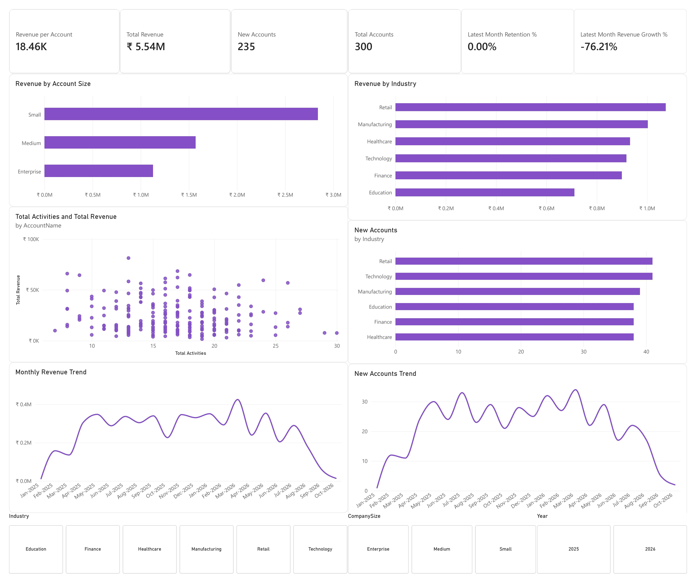

# Customer Account Growth & Revenue Analysis

## Project Overview

The Customer Account Growth Dashboard is a Microsoft Power BI business intelligence project designed to analyze customer acquisition, account growth, revenue performance, customer retention, and customer segment performance.

The dashboard transforms CRM and sales data into an interactive analytical report that helps identify customer growth patterns, revenue trends, and high-performing customer segments.

---

## Business Objective

The project aims to answer key customer growth and revenue questions:

- How many customer accounts do we have?
- How many new accounts are being acquired?
- How much revenue are customers generating?
- What is the average revenue per account?
- How is revenue changing over time?
- Which account sizes generate the most revenue?
- Which industries generate the most revenue?
- How are new accounts distributed across industries?
- Are customer accounts being retained?
- Which customer segments represent the strongest opportunities?
- Is customer engagement associated with revenue performance?

---

## Tools & Technologies

- Microsoft Power BI
- DAX
- Power Query
- Microsoft Excel

---

## Dataset

The project uses a CRM-style dataset containing customer account, deal, and activity information.

The dataset includes fields related to:

- Customer accounts
- Company size
- Industry
- Country
- Deals
- Deal stages
- Deal amounts
- Deal close dates
- Customer activities

The data was cleaned and transformed using Power Query and modeled in Power BI for analysis.

---

## Data Model

The Power BI model primarily consists of:

### Dim_Accounts

Contains customer-level information such as:

- Account ID
- Account Name
- Company Size
- Industry
- Country

### Fact_Deals

Contains deal-level information such as:

- Deal ID
- Account ID
- Deal Amount
- Deal Stage
- Close Date

### Dim_Calendar

A dedicated calendar table used for time-based analysis.

Key fields include:

- Date
- Year
- Month
- Month Name
- YearMonth
- YearMonth Sort

---

## Key KPIs

| KPI | Value |
|---|---:|
| Total Accounts | 300 |
| New Accounts | 235 |
| Total Revenue | ₹5.54M |
| Revenue per Account | ₹18.46K |
| Latest Month Retention | 0.00% |
| Latest Month Revenue Growth | -76.21% |

---

# Dashboard Overview

The overview page provides an executive-level summary of customer growth and revenue performance.

### Main KPIs

- Total Revenue
- Revenue per Account
- New Accounts
- Total Accounts
- Customer Retention
- Revenue Growth

### Core Visuals

- Revenue by Account Size
- Revenue by Industry
- Monthly Revenue Trend
- New Accounts Trend

---

### Analytical Visuals

- New Accounts by Industry
- Revenue Growth by Account Size
- Revenue per Account by Industry
- Customer Engagement vs Revenue
- Monthly Revenue Trend
- New Account Growth Trend

---

## Interactive Filters

The dashboard allows users to analyze customer performance using:

- Year
- Industry
- Company Size

---

## Key Insights

Based on the current dashboard:

- The customer base contains 300 accounts.
- 235 accounts are classified as new accounts.
- Total revenue is approximately ₹5.54M.
- Revenue per account is approximately ₹18.46K.
- Small accounts contribute the largest share of revenue by account size.
- Retail currently generates the highest revenue among the analyzed industries.
- New account acquisition varies considerably across industries and over time.
- Revenue shows significant month-to-month fluctuations.
- The latest month shows a substantial decline in revenue compared with the previous month.
- Latest-month retention is currently 0% based on the defined month-over-month retention methodology.

---

## Business Recommendations

### Investigate the latest revenue decline

The significant decline in latest-month revenue should be investigated to determine whether it is driven by:

- Fewer Won deals
- Lower average deal values
- Reduced customer activity
- Weak performance in specific industries
- Changes in account-size performance

### Focus on high-performing industries

Industries generating the highest revenue can be investigated for:

- Customer acquisition
- Upselling
- Cross-selling
- Account expansion

### Analyze account-size performance

Small accounts currently contribute a significant share of revenue. Their behavior can be analyzed to determine whether they represent opportunities for upselling and account expansion.

### Improve customer retention

The current retention result indicates that customer continuity requires further investigation.

Accounts showing declining activity or revenue can be prioritized for engagement and retention efforts.

---

## DAX & Power BI Techniques

The project uses DAX measures for:

- Total Revenue
- Revenue per Account
- New Accounts
- Total Accounts
- Revenue Growth
- Customer Retention

Power BI techniques demonstrated include:

- Data modeling
- Relationships
- Calculated columns
- Measures
- Time intelligence
- Custom date sorting
- Interactive slicers
- KPI cards
- Trend analysis
- Customer segmentation
- Revenue analysis
- Scatter plot analysis

---

## Skills Demonstrated

- Business Intelligence
- Data Analysis
- Power BI
- DAX
- Power Query
- Data Modeling
- Customer Analytics
- Revenue Analysis
- Customer Retention Analysis
- Dashboard Design
- Data Visualization
- Business Insights

---

## Files

### Power BI Dashboard

`Customer Growth Dashboard.pbix`

### Dashboard Screenshots

`dashboard-overview.jpg`

### Dataset

`CRM_PowerBI_Master_Dataset(5).xlsx`

---

## Disclaimer

This project is intended for educational and portfolio purposes.

The dataset is a CRM-style analytical dataset and does not represent confidential company data.
